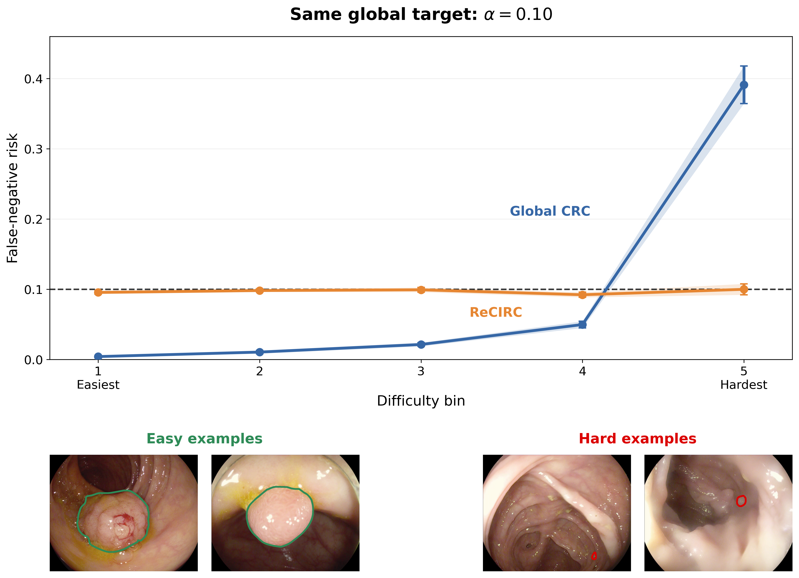

<p align="center">
  
</p>

---

**ReCIRC** (Rectified Conformal Risk Control) keeps the finite-sample marginal guarantee of conformal risk control (CRC) while adapting the decision parameter to each input. Global CRC picks a single threshold $\hat\lambda$ for every test point, so easy inputs end up far below the target risk $\alpha$ and hard inputs far above it. ReCIRC instead learns an estimate of the conditional risk $R(x,\lambda)$, inverts it at a common *risk budget* $a$ to obtain an input-specific $\lambda_a(x)$, and then calibrates the single scalar $a$ with CRC. The result is a risk profile that is close to flat at $\alpha$ whenever the risk model is informative, and a valid marginal guarantee regardless of how good the risk model is.

<p align="center">
  
</p>
<p align="center"><sub>Polyp segmentation (Experiment 3), target α = 0.10. Global CRC meets α on average by over-protecting easy images and under-protecting hard ones; ReCIRC holds every difficulty bin near α.</sub></p>

## The method

Let $\lbrace C_\lambda(x)\rbrace_{\lambda\in\Lambda}$ be a nested family of prediction sets (larger $\lambda$ means a larger set) and $\ell(\lambda; x, y)\in[0,B]$ a loss that is non-increasing in $\lambda$, such as a false-negative rate or a weighted miscoverage. The data are split into three independent parts: a context set $\mathcal D$, a calibration set $\mathcal C$ of size $n$, and a test set.

1. **Risk surface (on $\mathcal D$).** Fit a regressor $\hat R(x,\lambda)\approx \mathbb E[\ell(\lambda;X,Y)\mid X=x]$. The default backend is the tabular foundation model [TabICL](https://github.com/soda-inria/tabicl); a gradient-boosting backend is available in some experiments. Predictions are clipped to $[0,B]$ and made monotone in $\lambda$.
2. **Inversion at a budget.** For a budget $a$, set
      $$\lambda_a(x)=\min\lbrace\lambda\in\Lambda:\ \hat R(x,\lambda)\le a\rbrace,$$
   falling back to the largest $\lambda$ when no grid point qualifies.
3. **Rectification (on $\mathcal C$).** Choose the largest budget whose CRC bound stays below the target,
     $$\hat a=\max\Bigl\lbrace a:\ \tfrac{n}{n+1}\,\hat L_{\mathcal C}(a)+\tfrac{B}{n+1}\le\alpha\Bigr\rbrace,\qquad \hat L_{\mathcal C}(a)=\tfrac1n\textstyle\sum_{i\in\mathcal C}\ell\big(\lambda_a(X_i);X_i,Y_i\big).$$
4. **Deployment.** Return $C_{\lambda_{\hat a}(x)}(x)$ for each test input.

Because $\hat R$ is fitted on $\mathcal D$ only, the map $a\mapsto\ell(\lambda_a(x);x,y)$ is non-decreasing for every $(x,y)$, so step 3 is ordinary CRC over a one-dimensional family and inherits its marginal guarantee $\mathbb E\big[\ell(\lambda_{\hat a}(X);X,Y)\big]\le\alpha$. The quality of $\hat R$ affects only how evenly the risk is distributed, never validity.

## Repository layout

```
ReCIRC/
├── experiments/
│   ├── risk_calibration.py      held-out diagnostic: realized vs. budgeted risk
│   ├── make_crc_recirc_intuition.py
│   └── run_experiment_{1..8}_*.py
└── results/                     outputs of each experiment (CSV, PNG, PDF, JSON)
```

Each `run_experiment_*.py` script is self-contained: it downloads or simulates its data, runs every method over repeated random splits, and writes tables and figures to `results/<experiment>/`.

## Experiments

All experiments compare global **CRC**, **AA-CRC** (Blot et al., AISTATS 2025) and **ReCIRC** at $\alpha=0.10$. Conditional behaviour is evaluated on label-free difficulty bins or on fixed covariate slices that are never shown to any method.

| # | Script | Task | Loss | Data |
|---|--------|------|------|------|
| 1 | `run_experiment_1_heteroscedastic.py` | Regression intervals, heteroscedastic noise | Bounded excess loss | Synthetic |
| 2 | `run_experiment_2_multilabel.py` | Multilabel prediction sets (simple and 2-D complex DGPs) | False-negative rate | Synthetic |
| 3 | `run_experiment_3_tumor_segmentation.py` | Polyp segmentation masks from PraNet probability maps | Pixel false-negative rate | 1,798 images, ~1.3 GB, downloaded to `~/.cache/recirc` |
| 4 | `run_experiment_4_rcv1_text.py` | Multilabel text topics (103 RCV1-v2 topics) | False-negative rate | RCV1 via `sklearn.datasets.fetch_rcv1` |
| 5 | `run_experiment_5_letter_recognition.py` | Classification sets | Miscoverage | UCI Letter Recognition |
| 6 | `run_experiment_6_insurance.py` | Asymmetric regression intervals (QRF base model) | Weighted miscoverage (0.2, 0.8) | Medical Cost Personal dataset |
| 7 | `run_experiment_7_superconductor.py` | Asymmetric regression intervals (QRF base model) | Weighted miscoverage (0.2, 0.8) | UCI Superconductivity |
| 8 | `run_experiment_8_xor.py` | Mechanism probe with XOR heteroscedasticity | Weighted miscoverage (0.2, 0.8) | Synthetic |

`make_crc_recirc_intuition.py` builds the illustrative CRC-versus-ReCIRC figure from the Experiment 3 results.

## Installation

A recent Python 3 with the scientific stack is enough; a CUDA GPU is strongly recommended because TabICL is slow on CPU.

```bash
git clone https://github.com/heltongraziadei/ReCIRC.git
cd ReCIRC
python -m venv .venv && source .venv/bin/activate
pip install numpy pandas scipy scikit-learn matplotlib tqdm \
            tabicl quantile-forest pygam gdown
```

### AA-CRC baseline

The AA-CRC arms call the authors' own objective, loaded from a pinned copy of their repository (the SHA-256 of `multiaccurate.py` is checked at start-up). Clone it into the repository root:

```bash
git clone https://github.com/vincentblot28/AA-CRC.git
git -C AA-CRC checkout 64504c011ac2db910e258037e48170a63381b5e6
```

Experiments 4 to 8 also accept `--aacrc-repo PATH` if you keep the clone elsewhere (Experiment 4 clones the repository itself when it is missing).

## Running

Run the scripts from the repository root. Every script accepts `--help`; the most common options are shown below.

```bash
# offline sanity checks of the AA-CRC encoding and objective (experiments 5–8)
python experiments/run_experiment_8_xor.py --self-check

# full runs
python experiments/run_experiment_1_heteroscedastic.py --trials 20 --device cuda
python experiments/run_experiment_3_tumor_segmentation.py --trials 20
python experiments/run_experiment_7_superconductor.py --trials 20 --aacrc-basis both

# CRC and AA-CRC only, without TabICL
python experiments/run_experiment_6_insurance.py --no-recirc
```

Useful flags: `--trials` sets the number of random splits and, in most scripts, `--seed` sets their base seed, `--alpha` changes the target risk and `--no-plots` skips figure generation. Scripts 3 and 5 to 8 take `--output-dir`, scripts 1 to 3 take `--device {auto,cpu,cuda}`; scripts 6 to 8 take `--aacrc-basis {linear,rf,both}` to choose the AA-CRC feature map.

## Outputs

For every experiment, `results/<experiment>/` contains per-trial and aggregated metrics (marginal risk, worst-bin or worst-slice risk, mean excess over $\alpha$, set size or interval width), paired comparisons between methods over identical splits, the run configuration (`meta.json` or `protocol_config.json`), and the figures. Experiments that fit a ReCIRC risk surface also save a **risk-calibration diagnostic** (`risk_calibration*.csv`, `risk_calibration.png`), which compares the realized held-out risk with the budget $a$ across a grid of budgets, overall and per bin.

## Citation

The paper is in preparation. Until it is available, please cite this repository:

```bibtex
@misc{recirc2026,
  title  = {{ReCIRC}: Rectified Conformal Risk Control},
  author = {Resende, Bruno Marcondes and Graziadei, Helton and Ramos, Thiago Rodrigo and Izbicki, Rafael},
  year   = {2026},
  howpublished = {\url{https://github.com/heltongraziadei/ReCIRC}}
}
```

## Acknowledgements

The AA-CRC baseline uses the official implementation by Blot et al. (<https://github.com/vincentblot28/AA-CRC>). Risk surfaces are estimated with TabICL. The polyp-segmentation experiment reuses the cached PraNet probability maps distributed with the conformal risk control tutorial notebooks of Angelopoulos et al.
